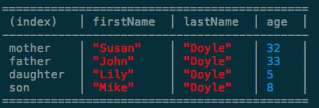

konsole.table [](http://badge.fury.io/js/konsole.table)
=====
*console.table API polyfill for Node.js*
***

**konsole.table** adds `console.table` support in Node so your same code can run in Node and in browser.

The aim of this module is to exactly replicate `console.table` API in browsers. This module uses `console.table` if already found which means it runs perfectly even when your Node.js code is ran in the browser through *browserify* etc.

Installation
-----

`npm install konsole.table`

Usage
-----
 
Require the module in your code:

```
require('konsole.table');
```

Then simply use `console.table` just like you would do in browser. 

[Read More](https://developer.chrome.com/devtools/docs/console#viewing-structured-data) and [more](https://developer.mozilla.org/en-US/docs/Web/API/Console/table) about `console.table`



Changelog
-----

See the [Changelog](https://github.com/chinchang/konsole.table/wiki/Changelog)

License
-----

MIT (c) 2015 Kushagra Gour, http://kushagragour.in

